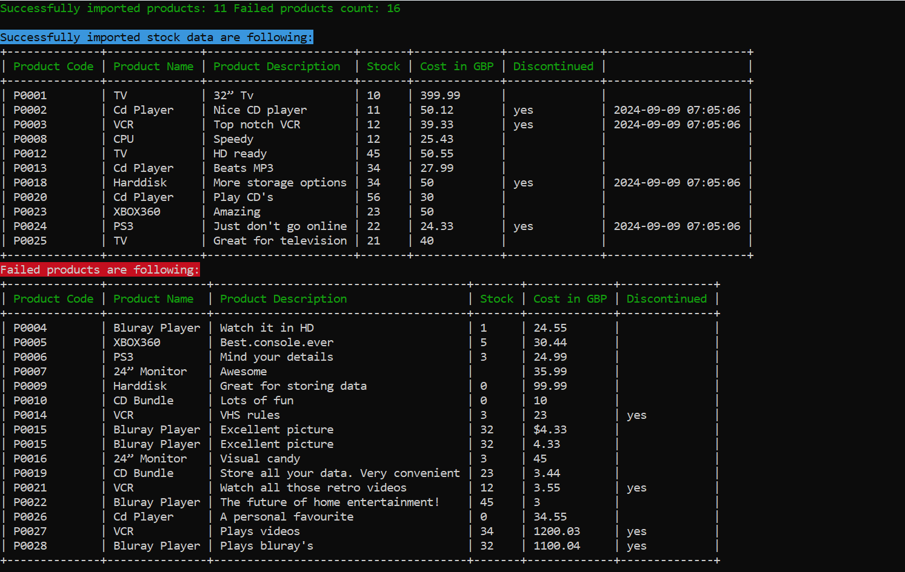

# Intro
> This project parses csv file and import data to MySQL database

# Project Overview

This project involves the parsing of CSV files containing product data, validation of business rules, and importing that data into a database. The code is organized into object-oriented classes, and functionality is tested using PHPUnit.
### List of Classes:
1. `CsvParser`: Responsible for parsing CSV files and managing raw data, headers, and failed rows.
2. `ParserService`: Handles product validation and import processes, using the parsed data from `CsvParser`.
3. `ImportData`: Command class responsible for executing the CSV import process.
4. `CsvParserTest`: Unit tests for the `CsvParser` class, verifying the CSV parsing logic.
5. `ParserServiceTest`: Unit tests for the `ParserService` class, verifying product validation and import functionality.

## Classes

### 1. CsvParser

**Namespace**: `App\Utils\CsvParser`

The `CsvParser` class is responsible for parsing CSV files and handling raw data, headers, and failed rows.

- **Properties**:
    - `$filePath`: The file path of the CSV to be parsed.
    - `$rawData`: Stores the parsed data from the CSV.
    - `$headers`: Stores CSV headers.
    - `$failedRows`: Stores rows with parsing errors (e.g., incorrect column count).

- **Key Methods**:
    - `parse()`: Parses the CSV file, extracts headers, data, and failed rows.
    - `setRawData()`, `getRawData()`: Set or get the parsed data.
    - `setHeaders()`, `getHeaders()`: Set or get the CSV headers.
    - `setFailedRows()`, `getFailedRows()`: Set or get the failed rows during parsing.

### 2. ParserService

**Namespace**: `App\Domain\Seeder\Services\ParserService`

The `ParserService` class processes the raw CSV data, validates the business rules, and prepares data for import into the database.

- **Properties**:
    - `$parser`: Instance of `CsvParser` used to handle CSV parsing.
    - `$products`: Stores the parsed product data.
    - `$successProducts`: Stores successfully validated products.
    - `$failedProducts`: Stores products that failed validation.
    - `$usdRate`: Exchange rate for converting GBP to USD.
    - `$minPriceUsd`, `$maxPriceUsd`, `$minStock`: Minimum and maximum business rules for price and stock levels.

- **Key Methods**:
    - `parseData()`: Parses the CSV data and stores it in the `$products` array.
    - `prepareProducts()`: Validates products based on price, stock, and business rules.
    - `importProducts($isTestMode = false)`: Imports validated products into the database. If `isTestMode` is `true`, the import is simulated.
    - `convertGbpToUSD()`: Converts GBP prices to USD based on the set exchange rate.

### 3. ImportData

**Namespace**: `App\Commands\ImportData`

The `ImportData` command class handles the execution of the CSV import process. It leverages the `ParserService` class to parse, validate, and import product data.

- **Key Functionality**:
    - The `ImportData` class can be run in normal mode or test mode. In test mode, no data is inserted into the database, but the parsing and validation process still runs.

## Unit Tests

Unit tests are provided using **PHPUnit** to ensure the correctness of the `CsvParser` and `ParserService` classes.

### 4. CsvParserTest

**Namespace**: `Tests\Unit\CsvParserTest`

Tests for the `CsvParser` class. These tests check the parsing functionality, including handling of headers, data, and failed rows.

- **Key Tests**:
    - `testParseCsvFile()`: Tests that the CSV file is correctly parsed.
    - `testSetAndGetRawData()`: Tests setting and retrieving raw data.
    - `testSetAndGetFailedRows()`: Tests handling of failed rows.
    - `testParseWithMissingFile()`: Ensures an exception is thrown if the CSV file is missing.

### 5. ParserServiceTest

**Namespace**: `Tests\Unit\ParserServiceTest`

Tests for the `ParserService` class, focusing on product validation and import functionality.

- **Key Tests**:
    - `testPrepareProductsValidProduct()`: Tests that valid products are prepared successfully.
    - `testPrepareProductsInvalidPrice()`: Tests that products with invalid prices are marked as failed.
    - `testImportProductsInTestMode()`: Tests that the import process runs in test mode without inserting data.
    - `testPriceConversion()`: Verifies that price conversion from GBP to USD works correctly.

## Usage

### Running the CSV Import

You can run the CSV import via the command line by using the `ImportData` command. The command supports both **test mode** (which validates data but does not insert into the database) and **normal mode** (which imports the data into the database).

- **Normal Mode**:

  ```bash
  php artisan import:stock
- **Test Mode**:

  ```bash
  php artisan import:stock test

### Result

